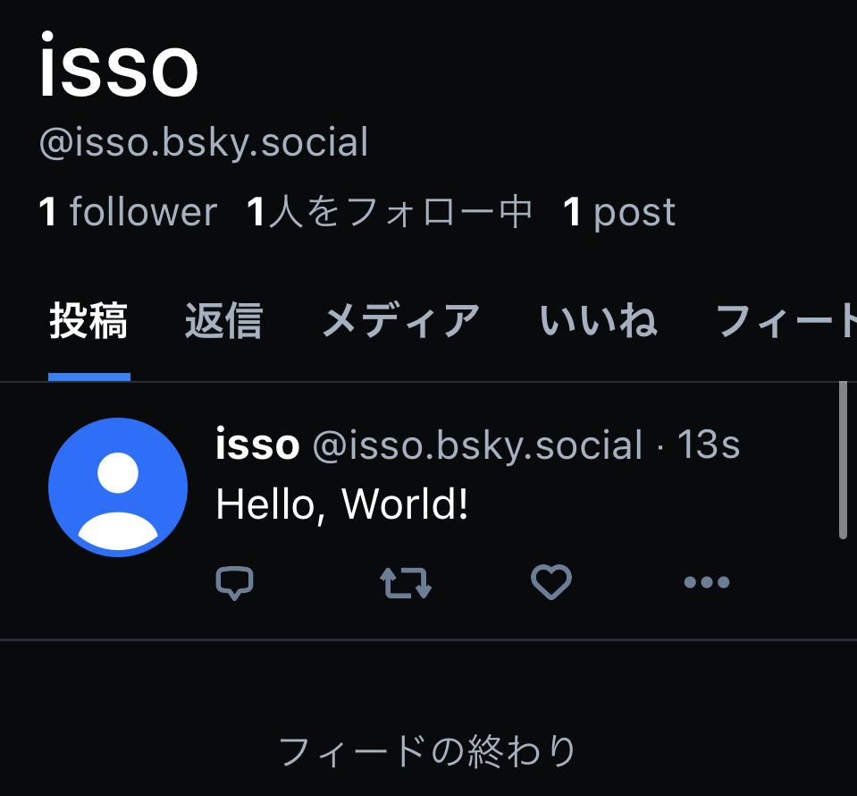

# はじめに

なんか、[Bluesky](https://bsky.app/) の招待制が無くなったぽくて、盛り上がっているらしい。

ということで、Bluesky を Golang から書き読みする記事です。
indigo という公式のクライアントを使用します。

全体の実装は、[ここ](https://github.com/isso-719/test-bsky-api-go/blob/main/main.go) にあります。

ちなみに BlueSky は AT Protocol という分散型 SNS 用のプロトコル上に構築されているらしいです。
内部実装は、HTTP ベースの XRPC というのを使っているのだとか。

# 実装

## 認証

以下で認証します。

```go
	// クライアントを作成
	client := &xrpc.Client{
		Host: "https://bsky.social",
	}

	// 認証
	actor := "dummy.bsky.social" // ここに自分の ID を入れる
	pw := "dummy"                // ここに自分のパスワードを入れる
	input := &atproto.ServerCreateSession_Input{
		Identifier: actor,
		Password:   pw,
	}

	ctx := context.Background()
	output, err := atproto.ServerCreateSession(ctx, client, input) // ここで Bearer トークンが取得できる
	if err != nil {
		panic(err)
	}

	client.Auth = &xrpc.AuthInfo{
		AccessJwt:  output.AccessJwt,
		RefreshJwt: output.RefreshJwt,
		Handle:     output.Handle,
		Did:        output.Did,
	}
```

ちなみに output をアウトプットすると、JWT トークンが取得できます。

## 投稿

以下で投稿します。「Hello, World!」を投稿します。

注意したいのが、`github.com/bluesky-social/indigo/util` と `github.com/bluesky-social/indigo/lex/util` で `util` 被りしてるので、
後者を `lexutil` としてインポートしています。

```go
	// 投稿を作成
	inp := &atproto.RepoCreateRecord_Input{
		Collection: "app.bsky.feed.post",
		Repo:       client.Auth.Did,
		Record: &lexutil.LexiconTypeDecoder{
			&bsky.FeedPost{
				Text:      "Hello, World!",
				CreatedAt: time.Now().Format(util.ISO8601),
				Langs:     []string{"ja"},
			},
		},
	}

	res, err := atproto.RepoCreateRecord(ctx, client, inp)
	if err != nil {
		panic(err)
	}

	fmt.Println(res.Uri)
```

実行すると、`fmt.Println(res.Uri)` で、投稿の URI が取得できます。

```
at://did:plc:ec46fk3n34iklugwgirjlyak/app.bsky.feed.post/3kkyifpqjfg2x
```



## ユーザ投稿の取得

自分の投稿を先頭から 10 件取得してみます。

```go
	// actor (自分) のフィードを新しい順に 10 件取得
	feed, err := bsky.FeedGetAuthorFeed(ctx, client, actor, "", "", 10)
	if err != nil {
		panic(err)
	}

	for _, f := range feed.Feed {
		fmt.Printf("%s\n", f.Post.Record.Val.(*bsky.FeedPost).Text)
	}
```

実行結果は、以下のようになります。

```
Hello, World!
```

# おわりに

Bluesky を Golang から書き読みするメモでした。

# 参考

- https://www.docs.bsky.app/
- https://atproto.com/docs/
- https://github.com/bluesky-social/indigo
- https://matope.hatenablog.com/entry/2023/08/17/164208
